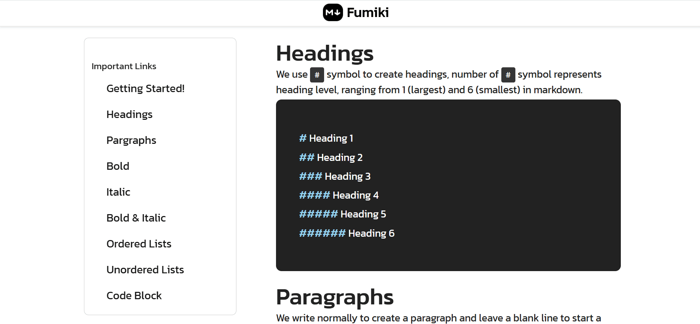

# Fumiki [](./CHANGELOG.md)

**Fumiki** is a lightweight, beginner friendly website that helps users learn Markdown syntax with ease. Whether you're writing documentation, blog posts or a polished `README.md` file, Fumiki gives you a clear guide with examples to get started quickly and confidently.


## ⚙️ Demo Screenshot



## 🔗 Live Demo

Try it out here: **[Fumiki](https://premkrrajbhar.github.io/fumiki/)**


## 📋 Features

- **Complete Markdown Guide** — Covers everything from headings to tables, links, images, footnotes & more.
- **Side Navigation** — Quickly jump between different Markdown topics.
- **Visual Examples** — Each syntax comes with live examples and usage.
- **Fully Responsive** — Works perfectly on desktop, tablet, and mobile.
- **SEO & Accessibility Ready** — Includes Open Graph meta and semantic structure.
- **Built with Simplicity in Mind** — Just open and start learning.


## 🛠️ Technologies Used

- **HTML5** – Markup structure.
- **CSS3** – Styling and layout customization.
- **Bootstrap 5** – Responsive grid system and components.
- **jQuery** – DOM interactions.
- **Font Awesome** – Iconography.
- **WebSlideMenu** – For responsive sidebar navigation.


## 💻 How to Use

- **Browse Topics:** Use the left sidebar to navigate different Markdown elements.
- **View Examples:** Check live output next to each syntax block.
- **Practice & Apply:** Use the knowledge to create your own Markdown documents.


## 🚀 How to Run Locally

- Step 1: Clone the repository:

```bash
   git clone https://github.com/premkrrajbhar/fumiki.git
```

- Step 2: Navigate to the project folder:

```bash
  cd fumiki
```

- Step 3: Open the `index.html` file in your web browser to start using the app.


## 📝LICENSE

Fumiki is open-source software released under the MIT License. This means you are free to use, modify, and distribute the code as per the terms of the MIT license. See the [LICENSE](/LICENSE) file for more information.

## 📄 Changelog

- See [CHANGELOG](./CHANGELOG.md) for a complete list of updates, fixes and version history.
- **Current Version:** `v1.0.0`

## 🤝 Contributing

Contributions are welcome! Feel free to submit a pull request or open an issue for any suggestions or improvements.

## 📞 Contact

For any questions or feedback, please reach out to:

- **Email**: [premkumarrajbhar22@gmail.com](mailto:premkumarrajbhar22@gmail.com)
- **GitHub**: [premkrrajbhar](https://github.com/premkrrajbhar)
